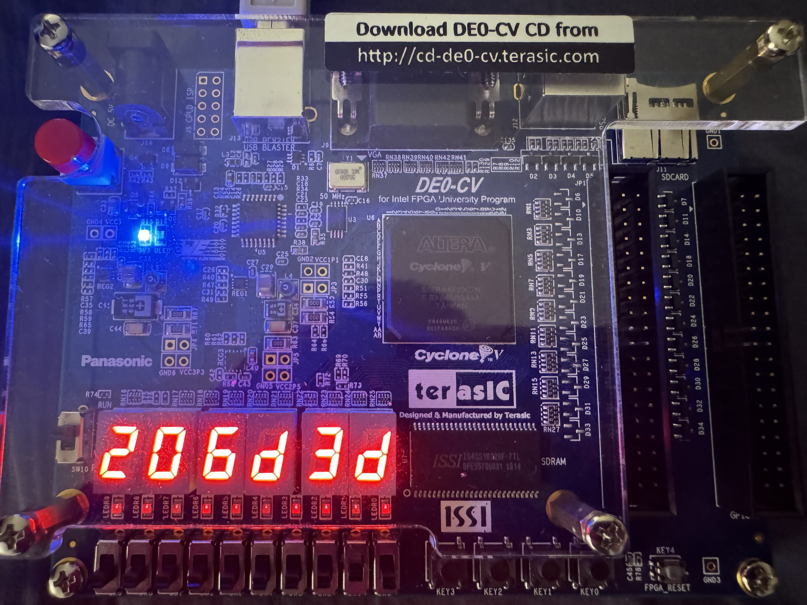
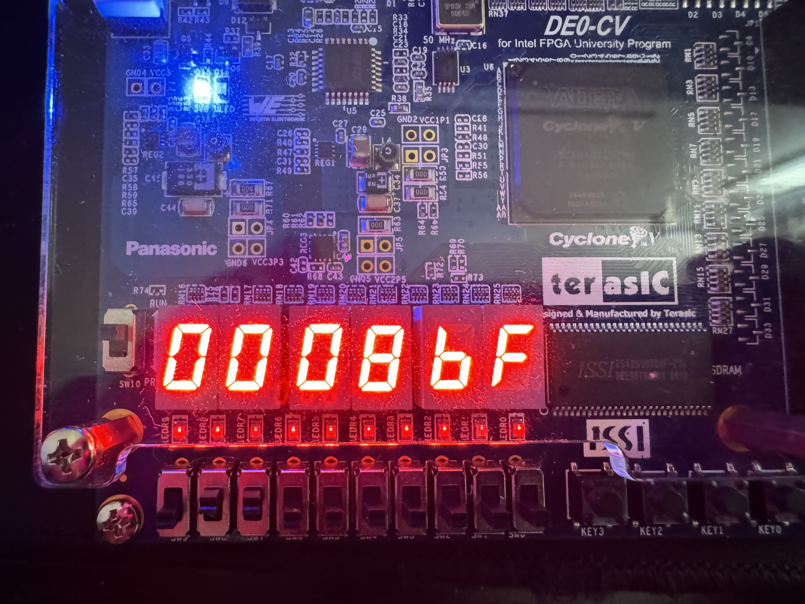

# Matrix Multiplier
## Project Overview

This project implements a matrix multiplier designed for the Cyclone V FPGA board. The goal is to efficiently compute the result of the following matrix equation:

Y (24-bit) = A (8-bit) * B (8-bit) + C (16-bit)

where:

- A: 128x128 matrix of 8-bit unsigned integers
- B: 128x1 column vector of 8-bit unsigned integers
- C: 128x1 column vector of 16-bit unsigned integers
- Y: 128x1 column vector of 24-bit unsigned integers

The project addresses the challenge of performing this computation efficiently in hardware, leveraging the FPGA's parallel processing capabilities and specialized hardware resources.

## Module Summaries
**MatrixMultiplier**

1. Top-Level Module: Integrates and connects all other modules to form the complete matrix multiplier system.

**Controller**

1. Finite State Machine (FSM): Controls the sequence of operations (reading input data, performing MAC operations, storing results) through different states (READ, LOAD, WRITE, CLEAR, END).                   
2. Address Generation: Generates addresses for the ROMs (romA, romB, romC) and the result RAM based on the current state.                              
   - For efficient matrix multiplication, the address generator for ROMs A and B is incremented by 4 in each cycle, allowing the simultaneous reading and multiplication of four data elements. When the address for ROM B reaches 124, indicating the completion of a row in matrix B, a state transition is triggered to proceed to the next stage of the computation.                      
3. Control Signal Generation: Produces control signals (sum, clear, mult, write) to activate specific operations in the MAC unit and result RAM.            
4. Clock Cycle Counter: Keeps track of the total clock cycles used for the matrix multiplication.            
5. End-of-Operation Signal: Generates the end_operation signal when the computation is finished.            

**Matrices**

1. ROM Interfaces: Instantiates multiple ROM modules to store the input matrices A, B, and C.              
2. Parallel Data Access: Provides parallel access to the data elements of the input matrices, utilizing     dual-port ROMs.                      
3. Pipelined Outputs: Registers the ROM output data to improve timing performance.          

**MultAccumulate (MAC)**

1. Parallel Multipliers: Instantiates multiple Multiplier modules to perform parallel multiplication of data elements from ROM A and ROM B.        
2. Accumulation: Accumulates the results of the multiplications, along with the corresponding values from ROM C.                
3. Pipelining: Uses pipeline registers to synchronize control signals and data flow, to meet timing requirements.                
4. Output: Provides the final accumulated results (finalResultA, finalResultB) for each computation cycle.

**ResultMatrix**

1. Result Storage: Stores the final results from the MAC unit in a dual-port RAM.                        
2. Result Accumulator: Accumulates the sum of all the results stored in the RAM.                                    
3. Read/Write Interface: Provides ports for reading individual results and the final accumulated sum.                        
4. End-of-Operation Signal: Generates the end_operation signal when all results have been written to RAM and accumulated.

**ChipInterface**

1. I/O Interface: Connects the matrix multiplier design to the FPGA board's switches and seven-segment displays.                        
2. Control and Display: Uses switches to control the reset signal and select between displaying the result or cycle count on the seven-segment displays.            
3. Seven-Segment Decoder: Instantiates SevenSegmentDecoder modules to convert numerical values into the appropriate patterns for the displays.        

## Timing Constraints and Optimization

The design is targeted for a 50 MHz clock constraint. Significant effort was put into meeting this constraint while maintaining high throughput.  Some of the key challenges and solutions included:

- Wallace Tree Multiplier: Initial attempts to use a Wallace tree multiplier were unsuccessful due to the long critical path. Switching to the lpm_mult IP core significantly reduced this path and improved overall timing. 
- Controller Signal Delays: Delayed load signals to the ROMs caused the same address values to be multiplied twice. Adding pipeline registers to synchronize the control signals resolved this issue.
- IO Pin Limitations: Early implementations exceeded the FPGA's 224 available IO output pads due to the large number of instantiated ROM blocks in the Matrices module. Limiting the number of ROM blocks to 9 resolved this issue.
- Accumulator Throughput Limitation: The original design used two accumulators for all multiplication results, which dropped FMAX below 50MHz and created a timing violation. By introducing two additional accumulators to handle the addition of two results at a time instead of four, the FMAX was improved to 93 MHz.

**Increased Parallelism and Design Complexity**: To meet the 50MHz clock constraint and improve overall throughput, I explored increasing parallelism within the design. This primarily involved increasing the number of parallel multipliers in the MultAccumulate module, allowing for simultaneous computations of multiple matrix elements. While this approach significantly improved the computational speed, it also increased the overall design complexity due to the additional logic and routing required to manage and synchronize the parallel operations. The increase in parallel operations also introduced a minor increase in latency due to the slightly longer paths for data to propagate through the additional multipliers. However, the gain in overall throughput outweighed this small latency increase, resulting in a net performance improvement.

## Design Testing

Each module in the design (Controller, Matrices, MultAccumulate, and ResultMatrix) was individually tested to verify their functionality. However, these tests were not comprehensive and are not included in this repository. A more thorough testbench is currently under development to comprehensively test the entire MatrixMultiplier module.

## Implementation Details and Results

**ROM Initialization:** The input matrices A, B, and C are initialized using .mif (Memory Initialization File) format.               
**Load Matrix Data:** Loaded the input matrices (A, B, and C) into the corresponding .mif files.                          
**Synthesize and Implement:** Used Intel Quartus Prime to synthesize and implement the design for your Cyclone V FPGA board.             
**Program the FPGA:** Loaded the generated bitstream to the Cyclone V FPGA Board.                       
**Observe Results:** The seven-segment displays will show either the calculated matrix sum or the number of clock cycles taken, depending on the state of switch SW[1].

**Results: Matrix Multiplication on Cyclone V FPGA Board**                
The matrix multiplication operation was successfully implemented on the Cyclone V FPGA board using the input files matA.mif, matB.mif, and matC.mif. The resulting hexadecimal matrix sum was displayed as 206d3d, and the total number of clock cycles required for the operation was 0008bf (hexadecimal), which corresponds to 2239 clock cycles in decimal representation.

 

## Future Work and Improvements

**Increased Parallelism:** Explore increasing the number of ROM blocks and parallel multipliers in the Matrices and MultAccumulate modules to further accelerate computation.    
**Systolic Array Implementation:** Investigate implementing a systolic array architecture for the MAC unit, potentially leading to significant improvements in throughput and efficiency.                          
**Alternative Algorithms:** Experiment with alternative matrix multiplication algorithms (e.g., Strassen's algorithm) to potentially reduce the number of operations required.  
**Improved Error Handling:** Add robust error detection and handling mechanisms to ensure the reliability of the design.

## Acknowledgments

This project was inspired by a project assignment in the Logic Design and Verification course at Carnegie Mellon University.  The original assignment provided the foundation for this implementation.
Below are files from the 18341 repository that were used or modified for this project. 

Files used: matA.mif, matA_2.mif, matB.mif, matB_2.mif, matC.mif, matC_2.mif                                                    
Files used and modified: Multiplier.sv, ChipInterface.sv
